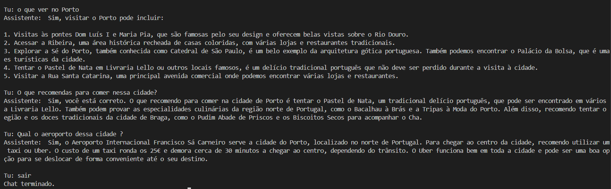

# RAG LOCAL COM PDFS + CHROMADB PERSISTENTE + OLLAMA

Este projeto implementa um sistema RAG (Retrieval-Augmented Generation) local com suporte a chat inteligente, utilizando documentos PDF como base de conhecimento.

O sistema combina recuperação semântica + geração com LLM para responder a perguntas de forma contextualizada.

---

# 🧠 TECNOLOGIAS UTILIZADAS

- Python
- ChromaDB (PersistentClient)
- Sentence Transformers (embeddings)
- Ollama
- Mistral LLM
- PyPDF

---

# 🚀 COMO FUNCIONA

Fluxo completo do sistema:

PDFs → Extração de texto → Chunking → Embeddings → ChromaDB (persistente)

Pergunta → HYDE (Query Expansion) → Embedding → Pesquisa semântica → Contexto + Histórico → Mistral → Resposta

---

# ⚡ TÉCNICA IMPORTANTE (HYDE)

Este projeto utiliza:

## 🔍 HYDE (Hypothetical Document Embeddings)

Implementado através da função:

augment_query_generation()

O que faz:

- Gera uma resposta hipotética à pergunta do utilizador
- Usa essa resposta para melhorar a pesquisa semântica
- Expande a query original com mais contexto
- Aumenta a precisão da recuperação de documentos

👉 Isto melhora significativamente a qualidade do RAG.

---

# 📂 ESTRUTURA DO PROJETO

```bash
project/
├── main.py
├── chroma_db/
├── README.md
├── Images/
│   └── saida.png
└── pdfs/
    ├── documento1.pdf
    ├── documento2.pdf
    └── documento3.pdf
```

---

# ⚙️ INSTALAÇÃO

## 1. Criar ambiente virtual

```bash
python -m venv env
```

---

## 2. Ativar ambiente virtual

### Windows

```bash
env\Scripts\activate
```

## 3. Instalar dependências

```bash
pip install -r .\requirements.txt
```

---

## 4. Instalar modelo Ollama

```bash
ollama pull mistral
```

---

# 🧠 FUNCIONAMENTO TÉCNICO

## 1. Indexação dos PDFs

- Lê todos os PDFs da pasta `pdfs/`
- Extrai texto
- Divide em chunks
- Gera embeddings
- Guarda no ChromaDB persistente

---

## 2. HYDE + QUERY EXPANSION

- Reescreve pergunta com contexto
- Gera resposta hipotética
- Combina query + hipótese
- Melhora pesquisa semântica

---

## 3. Pesquisa Semântica

- A pergunta é convertida em embedding
- O sistema procura os chunks mais relevantes
- Retorna contexto relevante

---

## 4. Geração de Resposta

O modelo Mistral recebe:

- Contexto dos PDFs
- Histórico da conversa
- Pergunta atual

E gera uma resposta baseada nesses dados.

---

## 5. Memória de Chat

O sistema mantém histórico da conversa:

- Permite perguntas de seguimento
- Mantém contexto da interação
- Melhora coerência das respostas

---

## 💾 PERSISTÊNCIA (CHROMADB)

Este projeto utiliza:

chromadb.PersistentClient(path="./chroma")

Isto significa:

- Os embeddings ficam guardados no disco
- Não é necessário reprocessar PDFs sempre
- Apenas novos PDFs precisam ser adicionados

---

# ▶️ Executar Projeto

```bash
python main.py
```

---

**Tu:** o que ver no Porto.
**Assistente:** Sim, visitar o Porto pode incluir:

1. Visitas às pontes Dom Luís I e Maria Pia, que são famosas pelo seu design e oferecem belas vistas sobre o Rio Douro.
2. Acessar a Ribeira, uma área histórica recheada de casas coloridas, com várias lojas e restaurantes tradicionais.
3. Explorar a Sé do Porto, também conhecida como Catedral de São Paulo, é um belo exemplo da arquitetura gótica portuguesa. Também podemos encontrar o Palácio da Bolsa, que é uma das principais atracções turísticas da cidade.
4. Tentar o Pastel de Nata em Livraria Lello ou outros locais famosos, é um delício tradicional português que não deve ser perdido durante a visita à cidade.
5. Visitar a Rua Santa Catarina, uma principal avenida comercial onde podemos encontrar várias lojas e restaurantes.

**Tu:** O que recomendas para comer nessa cidade?
**Assistente:** Sim, você está correto. O que recomendo para comer na cidade de Porto é tentar o Pastel de Nata, um tradicional delício português, que pode ser encontrado em vários locais da cidade, como a Livraria Lello. Também podem provar as especialidades culinárias da região norte de Portugal, como o Bacalhau à Brás e a Tripas à Moda do Porto. Além disso, recomendo tentar o famoso Vinho Verde da região e os doces tradicionais da cidade de Braga, como o Pudim Abade de Priscos e os Biscoitos Secos para acompanhar o Cha.

**Tu:** Qual o aeroporto dessa cidade?
**Assistente:** Sim, o Aeroporto Internacional Francisco Sá Carneiro serve a cidade do Porto, localizado no norte de Portugal. Para chegar ao centro da cidade, recomendo utilizar um taxi ou Uber. O custo de um taxi ronda os 25€ e demora cerca de 30 minutos a chegar ao centro, dependendo do trânsito. O Uber funciona bem em toda a cidade e pode ser uma boa opção para se deslocar de forma conveniente até o seu destino. 

--- # 🖼️ EXEMPLOS

Ver pasta: 



Contém prints de conversas reais com o sistema.

---

⚠️ 
**Nota técnica**:
Algumas respostas podem não ser totalmente precisas devido às limitações do pipeline RAG utilizado.

Este comportamento pode ser causado por:
- Chunking pode separar informação
- Embeddings leves (all-MiniLM-L6-v2)
- Top-k limitado
- Mistral pode ignorar contexto parcial

---

# ⭐ Resumo

Este projeto cria um assistente inteligente local especializado em turismo em Portugal, capaz de analisar os documentos PDF fornecidos e responder a perguntas sobre destinos, atrações, monumentos, gastronomia, cultura e locais de interesse turístico. Utilizando tecnologia RAG com IA, o sistema pesquisa automaticamente a informação mais relevante nos PDFs e gera respostas claras e contextualizadas.
Adicionalmente, mantém histórico de conversação, permitindo continuidade no diálogo e melhor compreensão de perguntas subsequentes.
Em comparação com o projeto anterior, foi incorporada a técnica HYDE (Hypothetical Document Embeddings), através do processo de query expansion, permitindo gerar uma resposta hipotética à pergunta do utilizador antes da pesquisa semântica.

---

# 👤 AUTOR

Francisco Guedes